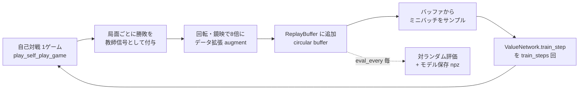

# 設計仕様書 — 自己学習型オセロ

対象バージョン: 2026-08時点の `master`（経験リプレイ・対称性データ拡張 導入後）

## 1. 概要

NumPy のみで実装された、自己対戦（self-play）によって強くなるオセロAI。
盤面を評価する価値関数を小さな全結合ニューラルネットワークで表現し、
自己対戦で得られた「実際の勝敗」を教師信号として繰り返し学習する。
探索木・外部MLフレームワークは使用しない。

## 2. モジュール構成

| モジュール | 責務 |
|---|---|
| `othello/board.py` | 盤面表現とオセロのルール（合法手判定・着手適用・勝敗判定）。AIロジックを含まない |
| `othello/network.py` | `ValueNetwork`：2層MLPによる局面評価関数。Adam最適化、npz形式での保存/読込 |
| `othello/agent.py` | 局面の特徴量エンコード、着手選択（1手読み + epsilon-greedy）、対称性によるデータ拡張、自己対戦1ゲームの実行 |
| `othello/train.py` | 学習ループ、`ReplayBuffer`、対ランダム評価、進捗表示 |
| `othello/play.py` | 人間 vs AI のターミナル対戦CLI |
| `othello/demo.py` | AI同士のターミナル観戦（`play.py` の盤面表示を再利用） |
| `othello/export_demo_games.py` + `webdemo_template.html` | AI同士の対局を棋譜としてJSON化し、自己完結HTMLビューアを生成 |

依存関係は一方向：`board.py` は他に依存しない純粋なルール実装、`agent.py` は
`board.py` と `network.py` に依存、`train.py`/`play.py`/`demo.py`/
`export_demo_games.py` はそれぞれ `agent.py` を利用するエントリポイント。

## 3. 学習1サイクルのデータフロー

## 4. 盤面表現とルール（`board.py`）

- 盤面は `8x8` の `int8` NumPy 配列。`EMPTY=0`, `BLACK=1`, `WHITE=-1`。
- `legal_moves` は8方向について「相手石が連続し、その先に自分石がある」列を
  探索して合法手を列挙する。
- `apply_move` は着手後の盤面を新しい配列として返す（元の盤面は変更しない
  = 自己対戦の記録に元の盤面参照をそのまま残せる）。
- 両者とも合法手が無ければ `is_game_over` が真になり終局、石数で `winner` を判定。

## 5. 局面の特徴量表現（`agent.encode`）

`FEATURE_DIM = 64 + 4 = 68` 次元。手番視点（`player` の石を「自分」とする）でエンコードする。

| 次元 | 内容 |
|---|---|
| 0–63 | 盤面64マスの `own - opp`（自分石=+1, 相手石=-1, 空=0）を flatten |
| 64 | 自分の合法手数 / 20 |
| 65 | 相手の合法手数 / 20 |
| 66 | 自分が取っている角の数 / 4 |
| 67 | 相手が取っている角の数 / 4 |

手作り特徴量は「着手可能数」と「角の確保」のみ。辺の安定石など、より高度な
特徴は未実装（[ROADMAP.md](ROADMAP.md) 参照）。

## 6. 価値ネットワーク（`network.ValueNetwork`）

- 構造: 入力68 → 全結合 → ReLU → 隠れ層（デフォルト64次元） → 全結合 → `tanh` → 出力1
- 出力の意味: 「その局面の手番側が最終的に勝つ見込み」を `[-1, 1]` で表す
- 損失: 予測値と実際の勝敗（+1/-1/0）とのMSE
- 最適化: Adam をNumPyで自前実装（`beta1=0.9`, `beta2=0.999`, `eps=1e-8`）
- 保存形式: `np.savez` で `W1, b1, W2, b2` を保存する `.npz` ファイル

## 7. 着手選択（`agent.choose_move`）

1. 確率 `epsilon` でランダムな合法手を選ぶ（探索）
2. それ以外は、全ての合法手について着手後の局面を作り、**相手視点**で
   `encode` → `net.predict` した値を符号反転して「自分にとっての価値」とし、
   最大のものを選ぶ（活用）
3. 探索木は持たず、常に1手先だけを評価する（詳細は
   [ROADMAP.md](ROADMAP.md) の探索導入案を参照）

## 8. 自己対戦とデータ拡張（`agent.play_self_play_game`）

1. 初期盤面から交互に `choose_move` で着手し、パスも処理しながら終局まで進める
2. 通過した各局面 `(board_state, player)` を記録
3. 終局後、勝敗に応じて各記録に教師信号 `y ∈ {+1, -1, 0}` を付与
   （モンテカルロ的な outcome regression。手番側から見た勝敗）
4. `augment=True`（デフォルト）の場合、`_board_symmetries` で各局面を
   回転・鏡映の8通りに複製してから `encode`。結果はどの向きでも変わらない
   ため、実質無料のデータ拡張になる

## 9. 学習ループと経験リプレイ（`train.py`）

- `ReplayBuffer`: 固定容量（`--replay-size`、デフォルト20000）の循環バッファ。
  `(feature, target)` を格納し、容量超過分は古いものから上書きする
- 1エピソード = 1自己対戦ゲーム。終了後、そのゲーム由来の（拡張済み）
  サンプルをバッファに追加
- バッファのサンプル数が `--batch-size`（デフォルト256）以上になったら、
  ランダムサンプルしたミニバッチで `--train-steps`（デフォルト4）回
  `train_step` を実行
- `epsilon` は `--epsilon-start`（0.3）から `--epsilon-end`（0.02）へ
  エピソード進行に応じて線形に減衰
- `--eval-every` エピソードごとに、学習中のネットを固定 (`epsilon=0`) で
  ランダム着手の相手と対戦させ勝率を測定し、モデルを `--out` に保存

## 10. CLIツール一覧

| コマンド | 用途 | 主な引数 |
|---|---|---|
| `python -m othello.train` | 学習 | `--episodes`, `--eval-every`, `--eval-games`, `--lr`, `--hidden`, `--epsilon-start/end`, `--replay-size`, `--batch-size`, `--train-steps`, `--no-augment`, `--out` |
| `python -m othello.play` | 人間 vs AI（ターミナル） | `--model`, `--human-color` |
| `python -m othello.demo` | AI同士の観戦（ターミナル） | `--model`, `--delay`, `--games`, `--epsilon` |
| `python -m othello.export_demo_games` | AI同士の棋譜をJSON/HTMLに出力 | `--model`, `--games`, `--epsilon`, `--out`, `--html` |

## 11. 既知の制約

- **探索木を持たない**: `choose_move` は常に1手読みのみで、終盤の読み抜け
  リスクがある
- **手作り特徴量が少ない**: 辺の安定石やパターン特徴などは未実装で、
  盤面パターンの学習は全結合層の重みに委ねられている
- **単一ネットワークのみでの自己対戦**: 過去のチェックポイントとの対戦が
  無いため、特定の戦略への偏りや循環的な性能低下（cycling）が起き得る
- **学習は単一プロセス・逐次実行**: 自己対戦の並列化は行っていない
